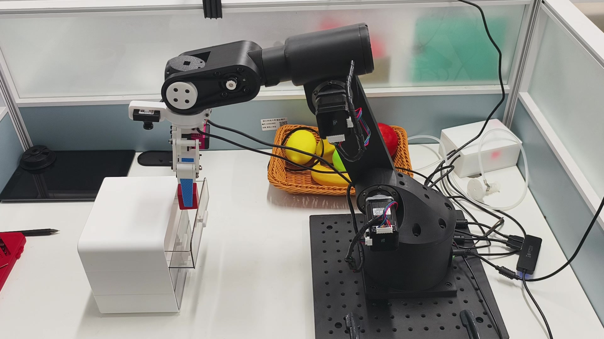
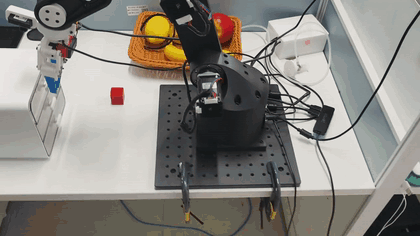

# Episode1 机械臂 π₀ 视觉语言动作项目

[English](README_EN.md)

基于 OpenPI 和 LeRobot 的 Episode1 单臂视觉语言动作（VLA）项目，包含遥操作数据采集、π₀（pi0）LoRA 微调，以及通过 WebSocket 连接策略服务的真机部署代码。模型根据固定相机、手眼相机、机器人状态和语言指令预测动作序列。


## 实机演示

抽屉操作与红色物块抓放实机演示。 点击封面可查看 41.4 秒原速视频。

| 实机封面 · 点击查看视频 | 动作预览 · GIF 2× |
| :---: | :---: |
| [](docs/media/demo.mp4) |  |

[查看原速实机视频（MP4）](docs/media/demo.mp4)

GIF 为 2 倍速连续片段，MP4 保持原速；视频无音轨。[素材说明](docs/media/README.md)

## 功能与范围

- Episode1 主从臂遥操作与 LeRobot 格式数据采集。
- 固定视角和手眼视角的双相机观测。
- 基于 OpenPI/JAX 的 pi0 LoRA 微调与数据归一化统计。
- GPU 策略服务与机器人端分离，通过 WebSocket 传输观测和动作。
- 单臂动作序列执行，以及可选的 Rerun 可视化。


## 目录结构

发布时保留以下两级目录关系，命令均以此为基础：

```text
pi0-episode1-publish/
├── .gitignore
├── README.md
├── README_EN.md
├── lerobot/                         # 机器人、遥操作、采集与部署
│   ├── README.md                    # 保留子项目原说明
│   ├── LICENSE
│   ├── CONTRIBUTING.md
│   ├── CODE_OF_CONDUCT.md
│   ├── pyproject.toml
│   ├── uv.lock
│   ├── MANIFEST.in
│   ├── lerobot_env.txt
│   ├── .gitignore
│   ├── testCommand.sh
│   ├── testcamera.py
│   ├── openpi_client_test.py
│   ├── enpei_scripts/              # 数据清理与角度转换工具
│   ├── packages/openpi-client/
│   └── src/lerobot/                # 保留运行所需的共享源码
│       ├── teleoperate.py
│       ├── record.py
│       ├── test_openpi.py
│       ├── episode_default_position.py
│       ├── robots/enpei_follower/
│       ├── teleoperators/enpei_leader/
│       ├── datasets/
│       ├── policies/
│       └── ...
└── openpi/                          # pi0 模型、训练与策略服务
    ├── README.md                    # 总目录说明的打包副本
    ├── README_EN.md
    ├── LICENSE
    ├── CONTRIBUTING.md
    ├── pyproject.toml
    ├── uv.lock
    ├── .python-version
    ├── .gitignore
    ├── enpei_client.py
    ├── openpi_client_test.py
    ├── docs/
    ├── packages/openpi-client/
    ├── scripts/
    │   ├── compute_norm_stats.py
    │   ├── train.py
    │   ├── serve_policy.py
    │   └── ...
    └── src/openpi/                  # 保留模型与训练依赖
        ├── models/pi0.py
        ├── training/config.py
        ├── policies/libero_policy.py
        ├── serving/
        └── ...
```


## 工作流程


## 环境与安装

训练端需要 Linux、NVIDIA GPU 及兼容 CUDA 12 的驱动。当前 OpenPI 项目要求 Python `>=3.11,<3.12`，锁定 `jax[cuda12]==0.5.3`、`flax==0.10.2`，并要求 `torch>=2.7.0`。机器人端要求 Python `>=3.10`，使用 `torch==2.6.0`。

**两端使用独立 Python 环境**。训练端通过自身配置安装指定提交的上游 LeRobot；机器人端使用本仓库的定制 LeRobot，不要把两者安装到同一环境。

安装 uv 后，从仓库根目录进入训练目录：

```bash
cd openpi_episode1_student
GIT_LFS_SKIP_SMUDGE=1 uv sync
uv run python -c "import jax; print(jax.devices())"
```

检查输出是否包含 GPU。优先保留本项目的 `pyproject.toml` 和 `uv.lock`，不要直接套用上游最新版依赖。当前包配置引用该目录下的 `README.md`：如果发布副本缺少它，可将根目录的两份 README 复制到该目录作为打包说明，安装与文件路径仍以仓库根目录这份文档为准。

机器人端在另一个终端，从仓库根目录执行：

```bash
cd lerobot_single_student
python3.10 -m venv .venv
source .venv/bin/activate
python -m pip install --upgrade pip
python -m pip install -e .
python -m pip install -e ../openpi_episode1_student/packages/openpi-client
```

机器人端还需要 Episode1 控制服务、主臂串口访问权限和相机驱动。`robots/enpei_follower/episode_server.py` 实际是连接控制服务的 TCP 客户端，不是独立启动机械臂控制服务的入口；配套控制程序需要另行准备。默认控制服务地址是 `localhost:12345`，策略服务端口是 `6006`，两者作用不同。

## 数据采集

在机器人端环境中，从 `lerobot_single_student/` 执行以下示例。先完成主从臂标定、相机编号检查，并启动硬件控制服务。相机 `0/2`、串口 `/dev/ttyACM0` 和任务文本都需要按实际设备修改。

```bash
python -m lerobot.record \
  --robot.type=enpei_follower \
  --robot.id=enpei_follower \
  --robot.ip_address=localhost \
  --robot.port=12345 \
  --robot.cameras="{fixed: {type: opencv, index_or_path: 0, width: 320, height: 240, fps: 30}, handeye: {type: opencv, index_or_path: 2, width: 320, height: 240, fps: 30}}" \
  --teleop.type=enpei_leader \
  --teleop.port=/dev/ttyACM0 \
  --teleop.id=enpei_leader \
  --dataset.repo_id=local/demo_drawer \
  --dataset.root=../dataset/demo_drawer \
  --dataset.single_task="Open the drawer." \
  --dataset.num_episodes=20 \
  --dataset.fps=30 \
  --dataset.push_to_hub=false \
  --enpei_use_radian=true
```

示例只保存本地数据。`enpei_use_radian=true` 表示使用弧度；如果已有数据使用角度，应统一采集、训练和部署的单位。关节顺序、夹爪定义与相机视角同样必须一致。遥操作入口为 `python -m lerobot.teleoperate`，硬件参数示例见 `testCommand.sh`。

## 数据字段适配

训练配置位于 `openpi_episode1_student/src/openpi/training/config.py`。当前单臂配置名为：

```text
enpei_robot_demo_drawer_low_mem_finetune
```

它使用 `LeRobotLiberoDataConfig`，默认读取已整理的数据字段：

| 数据集字段 | 推理输入字段 | 含义 |
| --- | --- | --- |
| `image` | `observation/image` | 固定相机 |
| `wrist_image` | `observation/wrist_image` | 手眼相机 |
| `state` | `observation/state` | 机器人状态 |
| `actions` | `actions` | 动作序列 |
| 任务元数据生成的 `prompt` | `prompt` | 语言指令 |

**直接用 `lerobot.record` 采集的数据不能假定与这些字段相同。** 先检查数据集 `meta/info.json` 的 `features`。对于标准的 `observation.images.fixed`、`observation.images.handeye`、`observation.state` 和 `action` 字段，需要在该类的 `RepackTransform` 中采用如下映射：

```python
{
    "observation/image": "observation.images.fixed",
    "observation/wrist_image": "observation.images.handeye",
    "observation/state": "observation.state",
    "actions": "action",
    "prompt": "prompt",
}
```

同时在该类返回的 `dataclasses.replace(...)` 中设置 `action_sequence_keys=("action",)`，使数据加载器按实际动作列生成时间序列。若已有数据使用 `image/wrist_image/state/actions`，保留原配置即可。当前没有提供通用的 Episode1 数据一键转换入口。

单臂适配器输出前 7 维动作，通常对应 6 个关节与夹爪；默认模型动作窗口为 50 步，内部填充维度为 32。当前配置对前 6 维启用相对动作转换，部署时恢复绝对动作，夹爪不做该差分。应确认原始训练动作是匹配的绝对目标，避免对已有增量动作再次差分。

## pi0 LoRA 微调

先修改上述单臂 `TrainConfig`：

| 配置 | 当前值 | 使用前处理 |
| --- | --- | --- |
| `data.repo_id` | `enpeicv/demo_drawer_openpi` | 改为实际数据集标识 |
| `data.root` | `./enpei_dataset/demo_drawer_openpi` | 改为实际本地数据目录 |
| `weight_loader` | `/root/autodl-tmp/pi0_base/params` | 改为基础模型的 `params` 路径 |
| `batch_size` | `32` | 根据显存调整 |
| `num_train_steps` | `20000` | 根据实验调整 |
| `save_interval` / `keep_period` | `1000` / `5000` | 根据存储与恢复需求调整 |

默认对语言视觉主干和动作专家使用 LoRA，关闭 EMA。基础模型来源可参考 [OpenPI 官方仓库](https://github.com/Physical-Intelligence/openpi)，其中 pi0 基础权重地址为 `gs://openpi-assets/checkpoints/pi0_base`。基础权重与本项目微调权重是两种不同资产。

在训练环境的 `openpi_episode1_student/` 下执行：

```bash
uv run scripts/compute_norm_stats.py \
  --config-name enpei_robot_demo_drawer_low_mem_finetune

uv run scripts/train.py enpei_robot_demo_drawer_low_mem_finetune \
  --exp-name my_experiment \
  --wandb-enabled=false
```

继续同一个实验时，在训练命令末尾增加 `--resume`。默认统计文件写入 `assets/<配置名>/<数据集标识>/`，检查点写入 `checkpoints/<配置名>/<实验名>/<step>/`。当前脚本使用从 0 开始的步号，20000 步训练的最后检查点通常为 `19999`，请以实际输出为准。

## 策略服务与真机部署

在训练环境的 `openpi_episode1_student/` 中启动服务，将路径替换为实际检查点目录：

```bash
uv run scripts/serve_policy.py --port 6006 policy:checkpoint \
  --policy.config enpei_robot_demo_drawer_low_mem_finetune \
  --policy.dir /path/to/checkpoint/19999
```

`--policy.dir` 指向同时包含 `params/` 与 `assets/` 的目录，不能只指向 `params/`。配置名称、资产标识和归一化统计必须与训练一致。跨机器部署时，机器人端 `--host` 填运行策略服务的机器地址。

确认实际相机、状态顺序、角度单位与训练数据一致后，在机器人环境的 `lerobot_single_student/` 中运行：

```bash
python -m lerobot.test_openpi \
  --robot.type=enpei_follower \
  --robot.id=enpei_follower \
  --robot.ip_address=localhost \
  --robot.port=12345 \
  --robot.cameras="{fixed: {type: opencv, index_or_path: 0, width: 320, height: 240, fps: 30}, handeye: {type: opencv, index_or_path: 2, width: 320, height: 240, fps: 30}}" \
  --host=localhost \
  --port=6006 \
  --instruction="Open the drawer." \
  --fps=30 \
  --display_data=false \
  --enpei_use_radian=true
```

这条命令会连接并控制真实机械臂，运行前应清空工作区、确认限位与急停可用。客户端将图像缩放至 224×224，通过独立线程请求动作序列；`--fps=30` 是控制目标频率，不代表模型推理频率达到 30 Hz。启用可视化可设置 `--display_data=true`。

## 权重与发布说明

微调权重目前没有公开下载链接，未来是否发布及发布地址待确定。若后续上传 Hugging Face，推理资产应保留完整的目录关系：

```text
<checkpoint-step>/
├── params/                         # 模型参数及相关元数据
└── assets/
    └── <asset_id>/
        └── norm_stats.json
```

推理不需要优化器 `train_state/`；需要恢复训练时，应保留完整训练检查点。发布权重时还应记录训练配置、代码版本、数据字段、关节顺序、动作单位与任务文本。不要将 OpenPI/JAX 检查点当作 LeRobot/PyTorch 的 `pretrained_model` 直接加载。


## 已知限制

- 默认训练路径和数据集标识来自已有开发环境，需要按部署机器修改。
- 根目录的 `openpi_client_test.py` 使用随机状态，不能当作真实数据或策略效果验证；`enpei_client.py` 的输入协议与这里的单臂适配器不同，推荐使用 `lerobot.test_openpi`。
- 真机客户端按观测字典中 `.pos` 字段的遍历顺序组装状态，缺失状态时还有默认值回退；部署前必须确认真实状态完整且顺序正确。

## 致谢与许可证

本项目基于 [Physical Intelligence OpenPI](https://github.com/Physical-Intelligence/openpi)、[Episode1 OpenPI 适配](https://github.com/enpeizhao/openpi_episode1_student) 和 [Hugging Face LeRobot](https://github.com/huggingface/lerobot)。保留各子项目的 `LICENSE`、版权声明与第三方许可；模型权重的许可应以其发布方说明为准。
