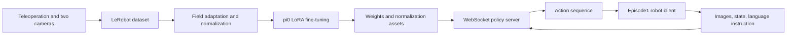

# Episode1 π₀ Vision-Language-Action Project

[简体中文](README.md)

An Episode1 single-arm vision-language-action (VLA) project built on OpenPI and LeRobot. It includes teleoperation data collection, π₀ (pi0) LoRA fine-tuning, and real-robot deployment through a WebSocket policy service. The policy predicts action sequences from a fixed camera, a wrist camera, robot state, and a language instruction.


## Features and scope

- Episode1 leader–follower teleoperation and LeRobot dataset recording.
- Fixed-view and wrist-view camera observations.
- OpenPI/JAX pi0 LoRA fine-tuning and normalization statistics computation.
- Separate GPU policy server and robot client, exchanging observations and actions over WebSocket.
- Single-arm action sequence execution and optional Rerun visualization.


## Repository layout

Preserve this directory relationship in the release. Commands below assume this layout:

```text
pi0-episode1-publish/
├── .gitignore
├── README.md
├── README_EN.md
├── lerobot/          # Robot, teleoperation, recording, deployment
│   ├── README.md                    # Original subproject documentation
│   ├── LICENSE
│   ├── CONTRIBUTING.md
│   ├── CODE_OF_CONDUCT.md
│   ├── pyproject.toml
│   ├── uv.lock
│   ├── MANIFEST.in
│   ├── lerobot_env.txt
│   ├── .gitignore
│   ├── testCommand.sh
│   ├── testcamera.py
│   ├── openpi_client_test.py
│   ├── enpei_scripts/              # Dataset cleanup and angle conversion
│   ├── packages/openpi-client/
│   └── src/lerobot/                # Shared runtime source retained
│       ├── teleoperate.py
│       ├── record.py
│       ├── test_openpi.py
│       ├── episode_default_position.py
│       ├── robots/enpei_follower/
│       ├── teleoperators/enpei_leader/
│       ├── datasets/
│       ├── policies/
│       └── ...
└── openpi/          # pi0 model, training, policy service
    ├── README.md                    # Copy of root documentation for packaging
    ├── README_EN.md
    ├── LICENSE
    ├── CONTRIBUTING.md
    ├── pyproject.toml
    ├── uv.lock
    ├── .python-version
    ├── .gitignore
    ├── enpei_client.py
    ├── openpi_client_test.py
    ├── docs/
    ├── packages/openpi-client/
    ├── scripts/
    │   ├── compute_norm_stats.py
    │   ├── train.py
    │   ├── serve_policy.py
    │   └── ...
    └── src/openpi/                  # Model and training dependencies retained
        ├── models/pi0.py
        ├── training/config.py
        ├── policies/libero_policy.py
        ├── serving/
        └── ...
```


## Workflow



## Environment and installation

The training machine needs Linux, an NVIDIA GPU, and a CUDA 12-compatible driver. The local OpenPI package requires Python `>=3.11,<3.12`, pins `jax[cuda12]==0.5.3` and `flax==0.10.2`, and requires `torch>=2.7.0`. The robot package requires Python `>=3.10` and pins `torch==2.6.0`.

**Use separate Python environments.** OpenPI installs a pinned upstream LeRobot commit through its own dependency configuration. The robot environment uses the customized LeRobot package in this repository. Do not install both into the same environment.

With uv installed, start from the repository root:

```bash
cd openpi_episode1_student
GIT_LFS_SKIP_SMUDGE=1 uv sync
uv run python -c "import jax; print(jax.devices())"
```

Verify that the output includes a GPU. Preserve this project's `pyproject.toml` and `uv.lock` instead of replacing them with current upstream dependencies. The package configuration references a local `README.md`: if that file is missing from the release copy, copy both root README files into this directory for packaging. Installation commands and paths in this guide remain relative to the repository layout above.

In another terminal, set up the robot environment from the repository root:

```bash
cd lerobot_single_student
python3.10 -m venv .venv
source .venv/bin/activate
python -m pip install --upgrade pip
python -m pip install -e .
python -m pip install -e ../openpi_episode1_student/packages/openpi-client
```

The robot also requires the Episode1 hardware control service, access to the leader arm's serial device, and camera drivers. Despite its name, `robots/enpei_follower/episode_server.py` implements a TCP client for the hardware service; it does not start that service. Obtain and configure the hardware control program separately. The default hardware service is `localhost:12345`; the policy server uses port `6006`.

## Data collection

Run the following example in the robot environment from `lerobot_single_student/`. First calibrate the arms, verify camera assignments, and start the hardware service. Replace camera indices `0/2`, serial device `/dev/ttyACM0`, and the instruction to match your setup.

```bash
python -m lerobot.record \
  --robot.type=enpei_follower \
  --robot.id=enpei_follower \
  --robot.ip_address=localhost \
  --robot.port=12345 \
  --robot.cameras="{fixed: {type: opencv, index_or_path: 0, width: 320, height: 240, fps: 30}, handeye: {type: opencv, index_or_path: 2, width: 320, height: 240, fps: 30}}" \
  --teleop.type=enpei_leader \
  --teleop.port=/dev/ttyACM0 \
  --teleop.id=enpei_leader \
  --dataset.repo_id=local/demo_drawer \
  --dataset.root=../dataset/demo_drawer \
  --dataset.single_task="Open the drawer." \
  --dataset.num_episodes=20 \
  --dataset.fps=30 \
  --dataset.push_to_hub=false \
  --enpei_use_radian=true
```

This example records locally without uploading the dataset. `enpei_use_radian=true` selects radians. If existing demonstrations use degrees, keep collection, training, and deployment consistent with those units. Joint order, gripper conventions, and camera views must also match. The teleoperation entry point is `python -m lerobot.teleoperate`; see `testCommand.sh` for hardware argument examples.

## Dataset field adaptation

Training configuration lives in `openpi_episode1_student/src/openpi/training/config.py`. The existing single-arm configuration is:

```text
enpei_robot_demo_drawer_low_mem_finetune
```

It uses `LeRobotLiberoDataConfig`, which expects the following prepared dataset fields by default:

| Dataset field | Inference field | Meaning |
| --- | --- | --- |
| `image` | `observation/image` | Fixed camera |
| `wrist_image` | `observation/wrist_image` | Wrist camera |
| `state` | `observation/state` | Robot state |
| `actions` | `actions` | Action sequence |
| `prompt`, generated from task metadata | `prompt` | Language instruction |

**Do not assume that a raw `lerobot.record` dataset already matches this schema.** Inspect `features` in `meta/info.json`. For standard `observation.images.fixed`, `observation.images.handeye`, `observation.state`, and `action` fields, update this class's `RepackTransform` mapping to:

```python
{
    "observation/image": "observation.images.fixed",
    "observation/wrist_image": "observation.images.handeye",
    "observation/state": "observation.state",
    "actions": "action",
    "prompt": "prompt",
}
```

Also set `action_sequence_keys=("action",)` in that class's returned `dataclasses.replace(...)`, so the loader constructs sequences from the actual action column. Keep the original configuration if your prepared dataset already uses `image/wrist_image/state/actions`. A general one-command Episode1 dataset converter is not included.

The single-arm adapter returns the first 7 action dimensions, typically six joints and a gripper. The default model horizon is 50 steps with an internal padded dimension of 32. The configuration converts the first six action dimensions to deltas during training and back to absolute targets during inference; the gripper is excluded. Verify that your raw actions are compatible absolute targets to avoid applying the conversion twice to delta actions.

## pi0 LoRA fine-tuning

Update the single-arm `TrainConfig` before running:

| Setting | Current value | Required adjustment |
| --- | --- | --- |
| `data.repo_id` | `enpeicv/demo_drawer_openpi` | Your dataset identifier |
| `data.root` | `./enpei_dataset/demo_drawer_openpi` | Actual local dataset directory |
| `weight_loader` | `/root/autodl-tmp/pi0_base/params` | Base checkpoint's `params` directory |
| `batch_size` | `32` | Adjust for available GPU memory |
| `num_train_steps` | `20000` | Adjust for the experiment |
| `save_interval` / `keep_period` | `1000` / `5000` | Adjust checkpoint retention |

The configuration enables LoRA for both the vision-language backbone and action expert, with EMA disabled. Refer to [upstream OpenPI](https://github.com/Physical-Intelligence/openpi) for base weights; its pi0 base checkpoint is `gs://openpi-assets/checkpoints/pi0_base`. Base weights and this project's fine-tuned weights are separate assets.

From `openpi_episode1_student/` in the training environment:

```bash
uv run scripts/compute_norm_stats.py \
  --config-name enpei_robot_demo_drawer_low_mem_finetune

uv run scripts/train.py enpei_robot_demo_drawer_low_mem_finetune \
  --exp-name my_experiment \
  --wandb-enabled=false
```

Append `--resume` to resume the same experiment. Statistics default to `assets/<config-name>/<dataset-id>/`, and checkpoints to `checkpoints/<config-name>/<experiment-name>/<step>/`. Training uses zero-based step numbers, so a 20,000-step run normally ends at checkpoint `19999`; use the directory actually produced by your run.

## Policy service and real-robot deployment

From `openpi_episode1_student/` in the training environment, replace the example path with your checkpoint:

```bash
uv run scripts/serve_policy.py --port 6006 policy:checkpoint \
  --policy.config enpei_robot_demo_drawer_low_mem_finetune \
  --policy.dir /path/to/checkpoint/19999
```

`--policy.dir` must contain both `params/` and `assets/`; do not point it directly to `params/`. The configuration, asset identifier, and normalization statistics must match training. For deployment across machines, set the robot client's `--host` to the policy server address.

After verifying camera assignments, state ordering, and angle units, run from `lerobot_single_student/` in the robot environment:

```bash
python -m lerobot.test_openpi \
  --robot.type=enpei_follower \
  --robot.id=enpei_follower \
  --robot.ip_address=localhost \
  --robot.port=12345 \
  --robot.cameras="{fixed: {type: opencv, index_or_path: 0, width: 320, height: 240, fps: 30}, handeye: {type: opencv, index_or_path: 2, width: 320, height: 240, fps: 30}}" \
  --host=localhost \
  --port=6006 \
  --instruction="Open the drawer." \
  --fps=30 \
  --display_data=false \
  --enpei_use_radian=true
```

This command connects to and moves physical hardware. Clear the workspace and verify joint limits and emergency stop before running it. The client resizes images to 224×224 and requests action chunks in a separate thread. `--fps=30` is the target control rate, not a claim of 30 Hz model inference. Set `--display_data=true` for visualization.

## Weights and code release

Fine-tuned weights do not currently have a public download link. A future Hugging Face release is under consideration. If published, inference assets should preserve the complete directory structure:

```text
<checkpoint-step>/
├── params/                         # Model parameters and associated metadata
└── assets/
    └── <asset_id>/
        └── norm_stats.json
```

Inference does not need optimizer `train_state/`; resuming training requires the complete training checkpoint. A model release should also document the training configuration, code revision, dataset fields, joint order, action units, and task instructions. OpenPI/JAX checkpoints cannot be loaded directly as LeRobot/PyTorch `pretrained_model` directories.


## Known limitations

- Default training paths and dataset identifiers come from an existing development environment and need adjustment.
- `openpi_client_test.py` at the OpenPI project root uses random states and is not a real-data or policy-quality evaluation. `enpei_client.py` uses a different input protocol from this single-arm adapter; use `lerobot.test_openpi` for the documented workflow.
- The robot client assembles state by iterating over `.pos` observation fields and falls back to a default state when those fields are missing. Verify that actual state feedback is complete and correctly ordered before deployment.


## Acknowledgments and licensing

This project builds on [Physical Intelligence OpenPI](https://github.com/Physical-Intelligence/openpi), the [Episode1 OpenPI adaptation](https://github.com/enpeizhao/openpi_episode1_student), and [Hugging Face LeRobot](https://github.com/huggingface/lerobot). Preserve each subproject's `LICENSE`, copyright notices, and third-party licenses. Model weights are subject to their publishers' terms.
